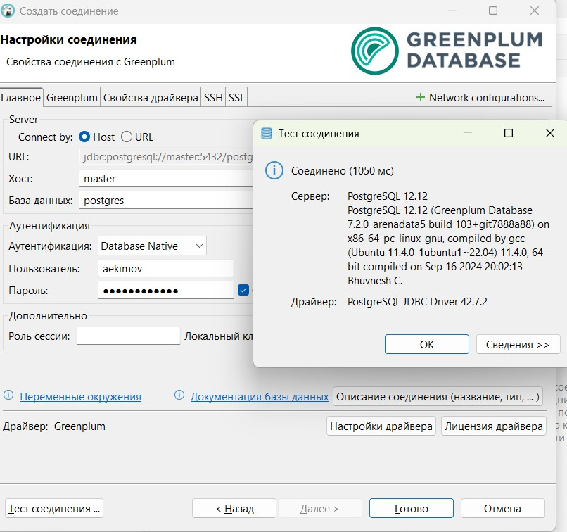

| **<br/>Лабораторная работа №5 по курсу "Greenplum для разработчиков и архитекторов баз данных"<br/>"Настройка ресурсных групп и ролей безопасности"<br/>**|
|---|

<br/>

## Задание:
### Настроить ресурсные группы пользователей (администраторы, технические пользователи, бизнес-пользователи)
### Создать пользователей на каждую группу. Определить метод аутентификации.
### На отдельной от Greenplum машине проверить доступ до БД через DBeaver/psql. Настроить политики доступа посредством конфигурационных файлов.
### Настроить шифрование диска с помощью pgcrypt
### Настроить отдельный сервер LDAP и связку с БД
### Настроить SSL-соединение


<br/>

## Решение:
* Создал три ресурсные группы
```
CREATE RESOURCE GROUP admin_rg WITH (cpu_max_percent=20,CONCURRENCY=10,MEMORY_LIMIT=20);
CREATE RESOURCE GROUP bi_rg WITH (cpu_max_percent=50,CONCURRENCY=30,MEMORY_LIMIT=50);
CREATE RESOURCE GROUP tech_rg WITH (cpu_max_percent=30,CONCURRENCY=20,MEMORY_LIMIT=30);
```


* Создал пользователей для каждой ресурсной группы
```
create role admin_usr with password 'admin_usr' login resource group admin_rg;
create role bi_usr with password 'bi_usr' login resource group bi_rg;
create role tech_usr with password 'tech_usr' login resource group tech_rg;
```


* На мастере и на стендбае в файле pg_hba.conf добавил разрешения на подключение пользователей


* На мастере перечитал конфигурацию
```
select pg_reload_conf();
```
* С другой машину подключился к СУБД под разными пользователями


* Установил расширение pgcrypto
```
create extension pgcrypto;
```
* Создал таблицу, вставил в нее данные (с помощью функции шифрования pgp_sym_encrypt), прочитал данные из таблицы в явном виде - получил шифрованные данные. Прочитал данные с помощью функции pgp_sym_decrypt и секрета, данные были предоставлены в читаемом виде


* Для авторизации с помощью LDAP развернул рядом ВМ, установил туда FreeIPA, создал пользователя aekimov


* В СУБД создал пользователя aekimov с возможностью подключаться к СУБД
```
create role aekimov with login ;
```
* В файл pg_hba.conf добавил разрешение на подключение пользователя aekimov с авторизацией через LDAP
```
host     all            aekimov     192.168.50.0/24    ldap ldapserver=ldap.home.local ldapprefix="uid=" ldapsuffix=",cn=users,cn=accounts,dc=home,dc=local"
```


* Перечитал конфигурацию
```
select pg_reload_conf();
```
* Подключился к СУБД с использованием psql под пользователем aekimov. При попытке ввести не правильный пароль получил ошибку авторизации. При правильном пароле доступ был предоставлен


* Через DBeaver доступ так же был предоставлен



* Для включения ssl, сгенерировал самоподписанный сертификат с помощью OpenSSL. В секцию alt_names добавил следующие имена
```
[alt_names]
DNS.1     = master.home.local
DNS.2     = master
DNS.3     = standby.home.local
DNS.4     = standby

openssl req -config san.cnf -new -x509 -sha256 -newkey rsa:2048 -nodes -keyout key.pem -days 365 -out key.cert.pem

```
* Сгенерированные файлы помести на мастер и стендбай по путям /data1/cert.crt и /data1/key.pem
* Установил им разрешение 0600 и владельцем сделал gpadmin
* Прописал в файле postgresql.conf парамтры для ssl


* В файле pg_hba.conf включил ssl


* Перечитал конфигурацию  
```
select pg_reload_conf();
```
* На машине с DBeaver добавил записи в файл hosts master - ip
* В DBeaver включил ssl, указал откртый ключ и подклчиля к СУБД 


